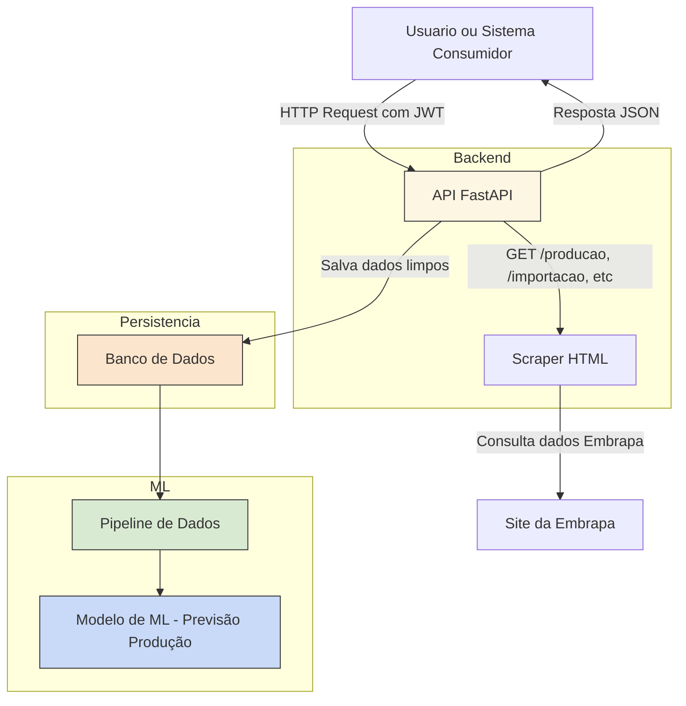

# API Vitivinicultura

API para consulta de dados da vitivinicultura brasileira, com foco no Rio Grande do Sul, utilizando **scraping** dinâmico da plataforma da Embrapa.

## Tecnologias

- [FastAPI](https://fastapi.tiangolo.com/)
- [Pydantic](https://docs.pydantic.dev/)
- [BeautifulSoup](https://www.crummy.com/software/BeautifulSoup/)
- [Uvicorn](https://www.uvicorn.org/)
- [OAuth2 + JWT](https://fastapi.tiangolo.com/tutorial/security/oauth2-jwt/)

## Instalação

```bash
git clone https://github.com/rmnobarra/api-vitivinicultura.git
cd api
python -m venv venv
source venv/bin/activate
pip install -r requirements.txt
uvicorn app.main:app --reload
```

## Documentação automática

- Swagger UI: [`http://localhost:8000/docs`](http://localhost:8000/docs)
- Redoc: [`http://localhost:8000/redoc`](http://localhost:8000/redoc)

---

## Autenticação

A API utiliza **JWT com OAuth2 (password flow)** para proteger os dados.

### Como obter o token

1. Acesse [`/docs`](http://localhost:8000/docs)
2. Clique no botão **Authorize**
3. Informe:
   - **username**: `admin`
   - **password**: `1234`
4. Clique em **Authorize** e **Close**

O token será utilizado automaticamente nas rotas protegidas.

### Obter token via curl

```bash
curl -X POST http://localhost:8000/login \
  -H "Content-Type: application/x-www-form-urlencoded" \
  -d "username=admin&password=1234"
```

---

## Endpoints da API

### `/producao?ano={ano}`
> Retorna os dados de produção de uvas no RS para o ano desejado.

```bash
curl -H "Authorization: Bearer <TOKEN>" "http://localhost:8000/producao?ano=2023"
```

### `/processamento?ano={ano}`
> Retorna os dados de processamento de uvas no RS.

### `/comercializacao?ano={ano}`
> Retorna os dados de comercialização de vinhos e derivados.

### `/importacao?ano={ano}`
> Dados de importações por país.

### `/exportacao?ano={ano}`
> Dados de exportações por país.

---

## Observações

- Os dados vão de **1970 até 2023** (ou 2024, conforme aba da Embrapa).
- A API realiza scraping em tempo real — pode haver variação de latência.
- Para evitar sobrecarga, não abuse de chamadas em loop.

---

## Testes com Pytest

Antes de executar os testes, ative o ambiente virtual:

```bash
cd api
source venv/bin/activate  # Linux/macOS
venv\Scripts\activate   # Windows
```

Depois, execute o seguinte comando:

```bash
PYTHONPATH=. pytest app/tests -v
```

> Isso garante que o diretório `app/` seja reconhecido como pacote no Python.

### ✅ O que os testes cobrem

- Endpoint `/docs` (Swagger UI)
- Login com JWT
- Acesso autenticado a todas as rotas:
  - `/producao`
  - `/processamento`
  - `/comercializacao`
  - `/importacao`
  - `/exportacao`

---

## Arquitetura do Projeto - API de Vitivinicultura



---

## Cenário de Aplicação para Machine Learning

### Previsão da Produção Nacional de Vinho nos Próximos Anos

**Objetivo**: prever a produção anual de vinho com base em dados históricos da Embrapa.

**Justificativas**:
- Apoiar decisões políticas e estratégicas no setor agrícola.
- Melhorar o planejamento logístico de produção e distribuição.
- Ajudar importadores/exportadores a antecipar volumes de mercado.

**Possíveis variáveis de entrada (features)**:
- Ano de referência
- Tipo de produto (vinho, suco, uvas)
- Quantidade histórica por categoria
- Dados complementares: clima, área plantada, geografia (futuramente)

---

## Plano de Deploy da API (MVP com Escalabilidade)

### Stack Tecnológica

- **FastAPI** como framework principal
- **Uvicorn** como servidor ASGI
- **BeautifulSoup** para scraping
- **SQLAlchemy + SQLite** (ou PostgreSQL no futuro)
- **Render.com** para deploy gratuito e simples
- **JWT** para autenticação de endpoints
- `.env` para gerenciamento de variáveis sensíveis

### Etapas para Deploy

1. Criar repositório no GitHub com `README.md`, `render.yaml` e `requirements.txt`
2. Adicionar comando de execução em start.sh:
   ```bash
   web: uvicorn app.main:app --host=0.0.0.0 
   ```
3. Configurar variáveis no painel da [Render](https://render.com/)
4. Conectar o GitHub e fazer o deploy automático
5. Testar a API online com autenticação e rotas públicas

### Live Demo

A aplicação pode ser acessada aqui:

**https://api-vitivinicultura-y62s.onrender.com**

---

## Contato

Desenvolvido por @rmnobarra.
